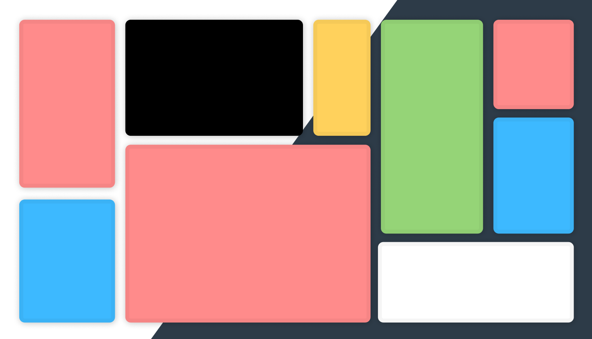

# [Polytask](https://polytaskdev.github.io/Polytask/)

A website, which helps with multitasking during school by having some of the most common things you need, think of it as a backpack. Instead of having to open multiple tabs for a calculator, dictionary, to write some quick notes etc, Just use polytask. It is a simple and easy way to keep productivity at a max.

## Features
Polytask includes multiple features listed below:
- A scientific calculator
- A built in Dictionary
- A timer/stopwatch/clock
- A place to write some quick notes
- Snake game, only if your done with your work :-)

## Prerequisites
You need a:
- Web Browser
- A Computer
- A brain and the ability to use it
- Oxygen
- And something idk

## How to run
To run Polytask you need to:
1. Go to [Polytask](https://polytaskdev.github.io/Polytask/)
2. Click the plus button on the website to add windows
3. Profit
 
## Creators
Zhenyu Liang (Adv), Tony, Sumah

### Tony Zhang
Hi! it was really fun participating in this Code Jam. I meet some great people on the discord server. 
I am a 13 year old in 8th grade.
visit my website if you want [tonyzhang.net](http://tonyzhang.net)
